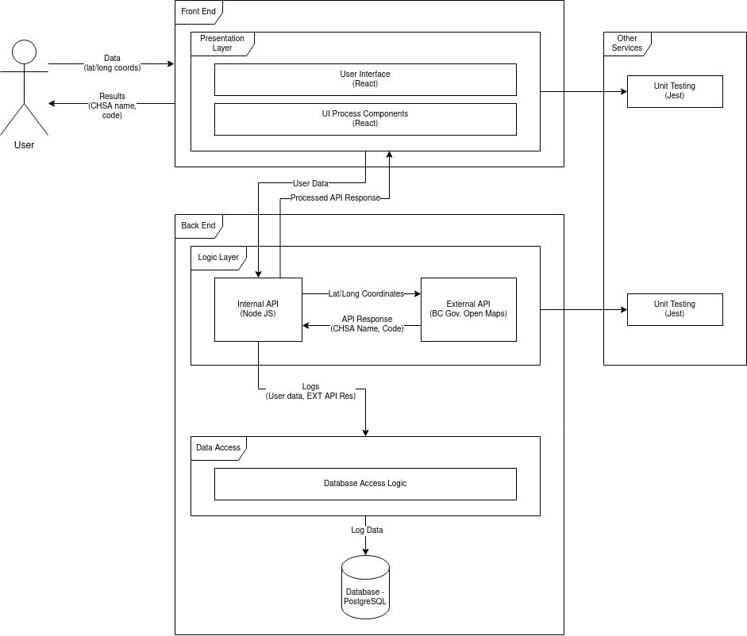

# chsa
A simple, proof-of-concept web app

## Pre-requisites
- Docker
- node
- npm
- ansible

### Instructions for building and deploying locally

# Step 1
If you have ansible installed on your machine, run this single-line CLI command
```
ansible-playbook playbooks/setup.yaml
```

Otherwise, manually create a `.env` file according to [the sample env file](./.env.sample) and run
```
mkdir pg_data &&\
    cd api && npm ci && npm run build &&\
    cd ../web && npm ci && npm run build
```

# Step 2 
Run `docker-compose up` at project root path.

# Step 3
Visit http://localhost:8888 via a web browser.

If you wish to skip web ui and directly interact with api,\
the service is at http://localhost:8100 and REST endpoint description can be found in [open api doc](api/public/doc/api/index.html)\
(need to open the html in a browser).

---

### Instructions on how to query db to find out # requests

See [DB README](db/README.md)

---

### Application Architecture



### TODO 

Due to a quick turnaround, these items are yet to be mature:
- unit tests coverage for both api and web component
- There is a severity vulnerability issue reported from `npm audit` - the issue is yet to be resolved.
- modify Docker persistent volume strategy
- create a Technical architecture diagram

### Future Roadmap
- Continually monitor and patch vulnerabilities
    - We must continually monitor the dependencies used in our application for any security vulnerabilities. For our Node packages, we manually run the `npm audit`, however we may want to incorprate this into our continuous integration system by automatically running this when pushing to master and rejecting the push if any high-risk vulnerabilities are found.
- Encryption for data in transit and at rest
    - We can make our application more secure by using SSL/TLS, which encrypts data in transit. This will also enable users to access our website using the https protocol, so they know they will be able to use our web application without their data being intercepted. We must also consider encrypting data at rest, especially if we decide to store sensitive user information, such as usernames and passwords.
- Placing application behind firewall and enabling access through reverse proxy
    - To add another layer of security we must place our servers behind a firewall and enable access through a reverse proxy server. This will enable tighter control of traffic to the backend and reject potentially malicious attacks. A proxy server can also be used for caching data - allowing users to access certain data more quickly - and as a load balancer, which can mitigate DDoS attacks.
- Server and application logs
    - We must enable server logs so we can better keep track of the actions performed within our server. We may also want to enable error logs to help us capture and debug server errors. We must also continue to capture application logs. Currently, our database captures basic information about the request/response data sent to/from the BC Open Maps API, but we may want to capture more details including input validation failures, authorization failures, authentication failures (if we decide to implement authentication), and other application errors. We currently store these logs in a PostgreSQL database, and if we continue to do that, we should ensure we are using a dedicated account for writing these logs. They may also be stored in the server file system. No matter where they are stored, they should be kept in a location with strict permissions and not be accessible through the web.
- Manage privileges
    - We must adhere to the principle of least privilege and limit parts of the application to only those that need access to it. Not every developer or employee requires access to every part of the application or component of the integration system.
